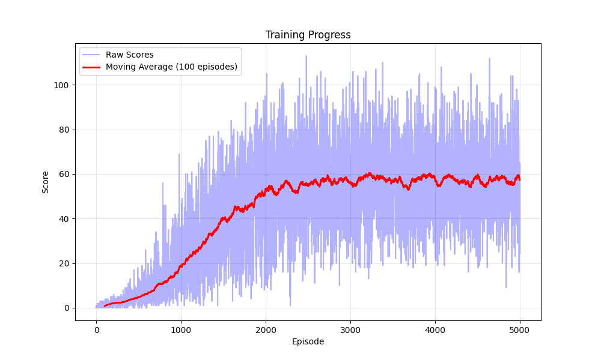

# Snake Reinforcement Learning 🐍

A Python implementation of the classic Snake game with reinforcement learning capabilities. This project combines a traditional Snake game implementation with a reinforcement learning environment, allowing AI agents to learn optimal gameplay strategies. This project does not use existing models or implementation nor import other RL libraries. Everything is demonstrated from scratch.

## Overview

This project consists of two main components:
1. A classic Snake game implementation using Pygame
2. A reinforcement learning environment for training AI agents

## Features

- 🎮 Fully playable Snake game with keyboard controls
- 🤖 Reinforcement learning environment with customizable parameters
- 📊 Score tracking and performance metrics
- 🎯 Configurable game settings (speed, grid size, etc.)
- 🔄 State management for AI training
- 🎨 Visual rendering for both human play and AI training

## Installation

```bash
# Clone the repository
git clone https://github.com/Trigo93/snake_rl.git

# Navigate to project directory
cd snake_rl

# Install required packages
pip3 install -r requirements.txt
```

## Project Structure

```
snake_rl/
├── snake.py          # Core Snake game mechanics
├── snake_game.py     # Pygame visualization and controls
├── train.py          # Run RL algorithm  
└── requirements.txt  # Project dependencies
```

## Usage

### Playing the Game

To play the Snake game manually:

```bash
python3 snake_game.py
```

Controls:
- ⬆️ Up Arrow: Move Up
- ⬇️ Down Arrow: Move Down
- ⬅️ Left Arrow: Move Left
- ➡️ Right Arrow: Move Right
- Q: Quit game
- C: Restart after game over

### Training an AI Agent

```bash
python3 train.py
```

### Results of RL algorithm

- Training progress over episode:

- With the provided tuning, convergence is reached after roughly 2000 episodes
- Video of a performance after convergence is available [here](results/last_game.mp4)
- The final q_table of a 5000 iteration training is provided in the results/ folder


## Game Configuration

The game can be configured through various parameters in `snake.py`:

```python
SCREEN_WIDTH = 400    # Width of game screen in pixels
SCREEN_HEIGHT = 300   # Height of game screen in pixels
SNAKE_BLOCK = 10      # Size of each snake/food block in pixels
SNAKE_SPEED = 15      # Game update frequency (moves per second)
```

## Contributing

Contributions are welcome! Please feel free to submit a Pull Request.

1. Fork the repository
2. Create your feature branch (`git checkout -b feature/AmazingFeature`)
3. Commit your changes (`git commit -m 'Add some AmazingFeature'`)
4. Push to the branch (`git push origin feature/AmazingFeature`)
5. Open a Pull Request

## License

This project is licensed under the MIT License - see the [LICENSE](LICENSE) file for details.

## Author

**Tristan Mallet** - [Github](https://github.com/Trigo93)

## Acknowledgments

- Thanks to Pygame for providing the game visualization framework
- Special thanks to the reinforcement learning community for inspiration and resources

## Future Improvements

- [ ] Implement various RL algorithms (DQN, etc.)
- [ ] Add better training visualization and progress tracking
- [ ] Implement different reward strategies to improve snake path planning and survival as its length grows.
- [ ] Implement a better state representation:
  - The snake full body could be added for less own body failure cases
  - The danger bitfield could be increased to more than the immediate neighbour cells to better anticipate blockage scenarios (such as dead-end)
- [ ] Add configuration file for easy parameter tuning
- [ ] Create comprehensive documentation for RL implementation
- [ ] Add performance comparison between different algorithms

---

For questions or suggestions, please open an issue on the GitHub repository.
